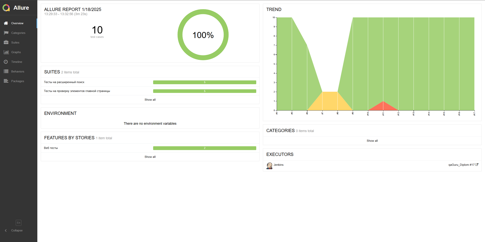
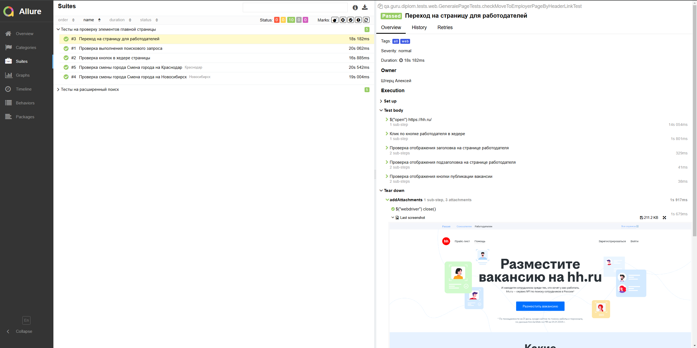
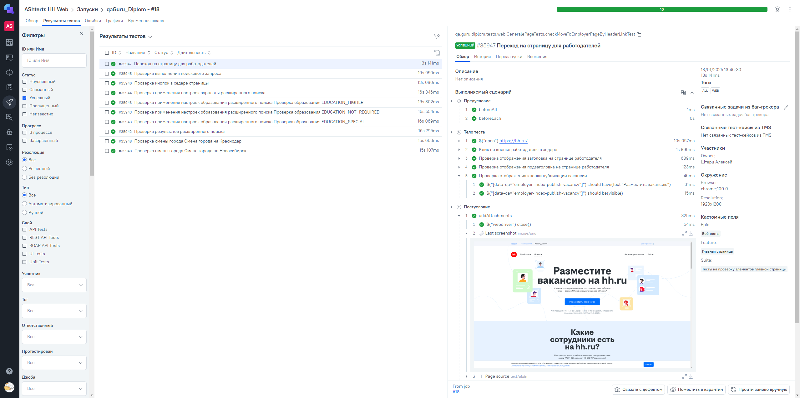
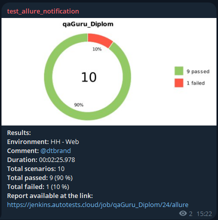
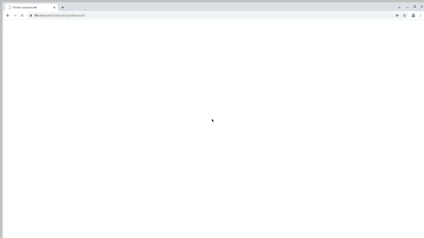

# Проект автоматизации тестирования сервиса HeadHunter

<a href="https://hh.ru/">

</a>

## Содержание
1. [Описание](#описание)
2. [Ссылки](#ссылки)
3. [Использованные технологии и инструменты](#использованные-технологии-и-инструменты)
4. [Запуск тестов](#запуск-тестов)
   - [Локальный запуск тестов](#локальный-запуск-тестов)
   - [Параметры web тестов](#параметры-web-тестов)
   - [Сборка тестов в Jenkins](#сборка-тестов-в-jenkins)
5. [Интеграции](#интеграции)
   - [Интеграция с Allure](#интеграция-с-ba-target_blank-hrefhttpsjenkinsautotestscloudviewartemleallureab)
   - [Интеграция с Allure TestOps](#интеграция-с-ba-target_blank-hrefhttpsallureautotestscloudproject4450dashboardsallure-testopsab)
   - [Уведомления в Telegram](#уведомления-в-telegram-с-использованием-бота)
6. [Технические особенности](#технические-особенности)
7. [Примеры прохождения автотестов](#пример-прохождения-автотестов)
   - [Web](#web)

## Описание

Данный проект направлен на автоматизацию Web и API тестов для сервиса [HeadHunter](https://hh.ru/).  <br/>
Headhunter - сервис, который помогает найти работу и подобрать персонал. <br/>

## Ссылки

### Jenkins: 
- Джоба запуска [api автотестов](https://jenkins.autotests.cloud/job/AShterts%20api/)
- Джоба запуска [web автотестов](https://jenkins.autotests.cloud/job/qaGuru_Diplom/)

### Test ops
- Проект [api автотестов](https://allure.autotests.cloud/launch/43985)
- Проект [web автотестов](https://allure.autotests.cloud/project/4574/dashboards)

## Использованные Технологии и инструменты

<div align="center">
<a href="https://www.jetbrains.com/idea/"></a>
<a href="https://www.java.com/"></a>
<a href="https://gradle.org/"></a>  
<a href="https://junit.org/junit5/"></a>
<a href="https://selenide.org/"></a>
<a href="https://rest-assured.io/"></a>
<a href="https://www.jenkins.io/"></a>
<a href="https://qameta.io/"></a>
<a href="https://telegram.org/"></a>
<a href="https://projectlombok.org/"></a>
</div>

## Запуск тестов
### Локальный запуск тестов

Для запуска следует открыть IntelliJ IDEA и выполнить в терминале:

- Для запуска всех тестов
```
gradle clean test
```
или
```
gradle clean test -Dtag=all
```
- WEB
```
gradle clean test -Dtag=web
```
- API
```
gradle clean test -Dtag=api 
```


#### Параметры web тестов

```
-Dbrowser - наименование браузера (значение по умолчанию: chrome)
-DbrowserSize - размер окна браузера.(значение по умолчанию: 1980x1080)
-DremoteUrl - адрес удаленного сервера, на котором будут запускаться тесты
```

<details>
   <summary>Дополнительные команды:</summary>

1. Выполнить запрос на формирование отчета:

```
gradle allureReport
```

2. Открыть отчет в браузере:

```
gradle allureServe
```

</details>

### Сборка тестов в Jenkins
>#### <b><a target="_blank" href="https://jenkins.autotests.cloud/job/qaGuru_Diplom/">Web</a></b>
> Для запуска сборки необходимо перейти в раздел `Build with Parameters`, если требуется выбрать нужные параметры
> BROWSER или BROWSERSIZE и нажать кнопку `Build`

> #### <b><a target="_blank" href="https://jenkins.autotests.cloud/job/AShterts%20api/">Api</a></b>
> У сборки нет параметров, достаточно нажать  `Build Now`.

## Интеграции
### Интеграция с <b><a target="_blank" href="https://jenkins.autotests.cloud/job/qaGuru_Diplom/allure/">Allure</a></b>

#### Пример прохождения автотестов:

   
   

### Интеграция с <b><a target="_blank" href="https://allure.autotests.cloud/project/4574/jobs">Allure TestOps</a></b>
#### Пример прохождения автотестов:

 

### Уведомления в [Telegram](https://t.me/+CFuoB1UND083MTVi) с использованием бота

> Бот, созданный в Telegram, после завершения сборки отправляет сообщение с отчетом о прохождении тестов
   
   
 
## Примеры прохождения автотестов
### Web
   
   

## Технические особенности

> [!NOTE]
> Убедитесь, что у вас установлены Java, Gradle, IntelliJ IDEA.

